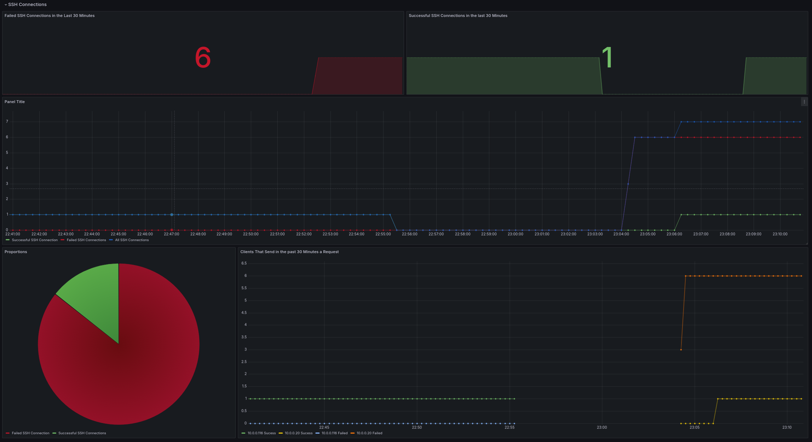

# prometheus-openssh-exporter

I could not find any SSH Prometheus monitoring tool for Prometheus that met my requirements.

This exporter allows you to monitor SSH connections.
It also show what IP's tries to connect to you'r server.
It will show all failed and successful connections.


## How it works

You will need to mount /var/log/journal, the exporter will look for the folder containing the current journal logs and check for entries from the opensshd daemon.
In a future release, I would like to add support for viewing active sessions.
This is a feature provided by another ssh exporter I found [prometheus-ssh-exporter](https://github.com/flor0/prometheus-ssh-exporter).

## Getting Started

For a sample configuration, see the docker-compose.yaml file.
This is a sample configuration for your Prometheus server.

```yaml
- job_name: ssh
    static_configs:
      - targets: ['prometheus-openssh-exporter:8080']
```


## Grafana Dashboard


